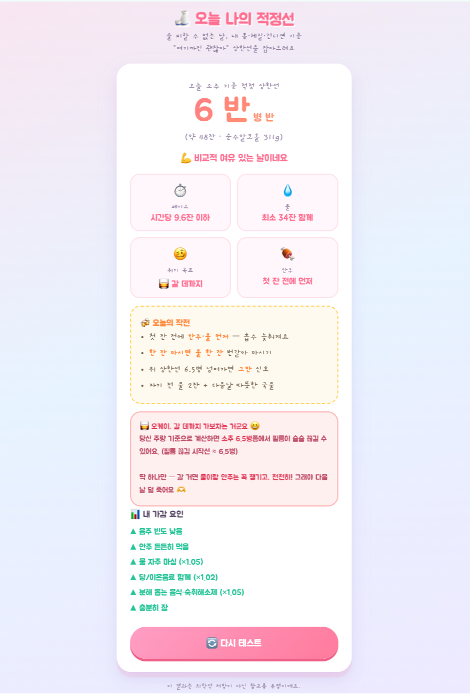

# 🍶 오늘 나의 적정 음주량 (today-i-drink)

술 피할 수 없는 날, **내 몸·체질·컨디션 기준으로 "여기까진 괜찮아" 상한선**을 잡아주는 단일 HTML 웹앱.

- 백엔드/빌드 없음 — `index.html` 파일 하나로 동작
- 귀여운 폰트(Google Fonts: Jua/Gaegu) 사용 → 인터넷 연결 시 자동 적용

> ⚠️ 이 결과는 의학적 처방이 아닌 **재미·참고용 추정값**입니다.
> 가장 건강한 음주량은 0잔이며, 음주운전은 절대 금지입니다.

## 📸 미리보기

<p align="center">
  
</p>

> 결과 화면 예시 — 취기 목표·페이스·물 권장량·오늘의 작전·가감 요인까지 한눈에.

---

## 🧮 계산 방식

"점수 합산" 방식이 아니라 **2단계 계산 + 컨디션 보정** 구조다.

### 1단계: 목표 혈중알코올농도(BAC) 정하기

**목표 취기 × 평소 주량** 두 가지로 결정한다.

| 목표 취기 | 기준값 |   | 평소 주량 | 배율(tolScale) |
|---|---|---|---|---|
| 😐 맨정신 | 0.048 |   | 🥤 못마심 | ×0.6 |
| 😊 알딸딸 | 0.128 |   | 🍶 보통 | ×0.8 |
| 🥴 적당히 | 0.210 |   | 🍶🍶 잘마심 | ×1.05 |
| 🥃 필름 | 0.290 |   | 🐉 말술 | ×1.3 |

> 기준값은 실제 혈중알코올농도가 아니라 **재미용으로 튜닝한 "취기 계수"**다.
> (말술이 필름까지 가려면 소주 ~4병 정도 나오도록 맞춤)

```
목표 BAC = 기준 BAC × 주량 배율
```

### 2단계: 그 BAC를 만드는 술 양 역산 (Widmark 공식)

```
알코올(g) = (목표BAC + 0.015 × 마실시간) × (체중kg × r × 10)
   r = 남 0.68, 여 0.55

소주 1병 = 순수 알코올 약 46.9g   (= 360ml × 16.5% × 0.789)
병 수 = 알코올g ÷ 46.9   (0.5병 단위 반올림)
소주 1잔 ≈ 6.5g
```

체중·성별·마실 시간이 여기서 반영된다. (무거울수록, 오래 마실수록 양 ↑)

### 3단계: 컨디션·습관으로 ± 곱하기

2단계 결과에 아래 배율을 모두 곱한다.

| 항목 | 배율 |
|---|---|
| 얼굴 빨개짐 | 금방 ×0.5 · 좀 ×0.75 · 안 ×1 |
| 음주 빈도 | 주3~4회 ×0.82 · 거의매일 ×0.65 |
| 나이 | 40대 ×0.88 · 50대+ ×0.8 |
| 안주 | 항상 ×1 · 가끔 ×0.92 · 거의안먹음 ×0.82 · 술만 ×0.68 |
| 챙김(중복) | 물 ×1.05 · 당/이온음료 ×1.02 · 분해음식·해소제 ×1.05 |
| 수면 | 3~5h ×0.83 · 3h미만 ×0.7 |
| 몸 상태 | 빈속/더부룩 ×0.82 · 몸살·약 복용 ×0.68 |
| 내일 일정 | 가벼움 ×0.92 · 출근/중요 ×0.78 |

> 숙취해소제는 "분해 돕는 음식"과 한 칸으로 묶여 있다.
> 약 복용 중(몸 상태 ×0.68) 선택 시에는 음주 비추천 안내가 뜬다.
> "필름 끊김" 목표는 별도 경고 박스로 안전선 vs 필름 시작선을 함께 보여준다.

---

## 📊 결과 예시표 (65kg 남, 3시간, 컨디션 보정 없음)

| 목표 \ 주량 | 못마심 | 보통 | 잘마심 | 말술 |
|---|---|---|---|---|
| 맨정신 | 0.5병 | 1병 | 1병 | 1병 |
| 알딸딸 | 1병 | 1.5병 | 1.5병 | 2병 |
| 적당히 | 1.5병 | 2병 | 2.5병 | 3병 |
| 필름 | 2병 | 2.5병 | 3.5병 | 4병 |

## 🔢 실제 계산 예시

**65kg 남 / 3시간 / 알딸딸 / 보통 주량 / 얼굴 좀 빨개짐 / 안주 가끔 / 물 챙김 / 내일 출근**

1. 목표BAC = 0.055 × 1.0 = **0.055**
2. 기본 알코올 = (0.055 + 0.045) × 442 = **44.2g**
3. ×0.75(빨개짐) ×0.92(안주) ×1.05(물) ×0.78(출근) = **×0.565**
4. 최종 = 44.2 × 0.565 ≈ **25g → 소주 0.5병 (약 4잔)**

---

## 🚀 배포

`index.html` 하나만 올리면 된다.

- **Netlify Drop**: <https://app.netlify.com/drop> 에 이 폴더를 드래그&드롭
- **GitHub Pages / Vercel / Cloudflare Pages** 등 정적 호스팅 어디든 가능

---

## ⚙️ 참고 / 한계

- 숙취 점수·취기·필름 끊김 추정은 **검증된 의학 공식이 아니다** (Widmark 공식만 정식, 그 외 배율은 휴리스틱).
- 결과는 0.5병 단위로 반올림되어 중간 구간(알딸딸~적당히)이 뭉뚱그려져 보일 수 있다.
- ALDH(알코올 분해효소) 등 개인차는 직접 측정 불가 → "얼굴 빨개짐" 같은 신호로 간접 추정한다.
